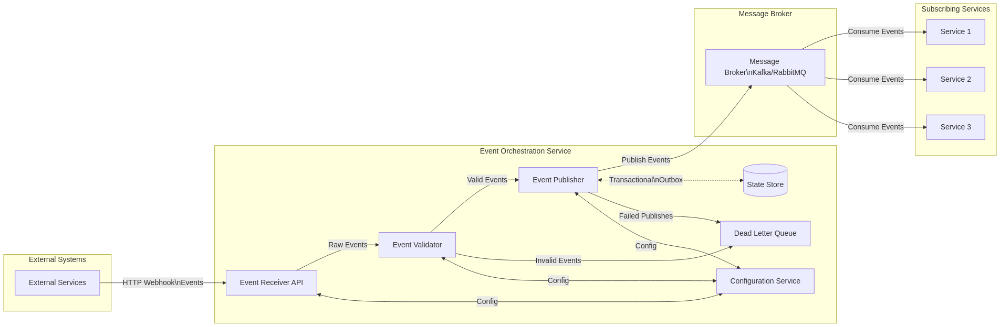

# Orchestron Service

A general-purpose, scalable service that receives webhook events and publishes them to message brokers (Kafka/RabbitMQ) for other services to consume. (EventFlow, Conduit, Hermes)

## Technical Documentation

For detailed technical information about the system architecture, components, configuration, and deployment, please see the [Technical Documentation](./docs/technical_documentation.md).


## Architecture Overview



The service follows a modular, layered architecture with the following components:

### Core Components

1. **Event Receiver API** - HTTP server that receives webhook events
2. **Event Validator** - Validates events against JSON schemas
3. **Event Publisher** - Publishes events to the message broker using the outbox pattern
4. **Dead Letter Queue** - Stores and manages failed events
5. **Configuration Service** - Manages dynamic configuration
6. **Outbox Processor** - Reliably publishes events from the outbox to the broker

### Message Broker Support

The service supports multiple message brokers:

- **Kafka** - For high-throughput event streaming
- **RabbitMQ** - For flexible routing with exchanges

## Features

- **Event Schema Validation** - Validates events against JSON schemas
- **Dynamic Routing** - Routes events to different topics/exchanges based on configuration
- **Transactional Outbox** - Ensures reliable event publishing even during failures
- **Dead Letter Queue** - Captures and manages failed events
- **Metrics & Monitoring** - Tracks system health and performance
- **Horizontal Scaling** - Scales horizontally to handle increasing load

## Getting Started

### Prerequisites

- Go 1.20+
- PostgreSQL 13+
- Kafka or RabbitMQ

### Installation

1. Clone the repository:

```bash
git clone https://github.com/chashtager/orchestron.git
cd orchestron
```

2. Install dependencies:

```bash
go mod download
```

3. Create the database:

```bash
createdb orchestron
psql -d orchestron -f config/sql/schema.sql
```

4. Configure the service:

```bash
cp config/config.yaml.example config/config.yaml
# Edit config.yaml with your settings
```

5. Build the service:

```bash
go build -o build/orchestron ./cmd/orchestron
go build -o build/subscriber ./cmd/subscriber # example rabbitmq subscriber for test
```

### Running the Service

```bash
./build/orchestron
```

### Docker Deployment

A Dockerfile and docker-compose.yml are provided for containerized deployment:

```bash
docker-compose up -d
```

## Configuration

The service can be configured using a YAML file, environment variables, or a combination of both:

```yaml
# Example configuration
api:
  address: ":8080"
  rate_limit: 100
  rate_limit_burst: 20
  max_payload_size: "1MB"

database:
  host: "localhost"
  port: 5432
  user: "postgres"
  password: "postgres"
  name: "orchestron"
  max_connections: 20

broker:
  type: "rabbitmq"  # or "kafka"
  rabbitmq:
    host: "localhost"
    port: 5672
    user: "guest"
    password: "guest"
    vhost: "/"
    prefetch_count: 100

routing:
  default_topic: "events"
  default_exchange: "events"
  default_routing_key: "#"
  max_retries: 3

outbox:
  process_interval: "5s"
  batch_size: 100
```

## Monitoring and Management

The service exposes metrics and health checks:

- **Health Check**: `GET /health`
- **Metrics**: `GET /metrics` (Prometheus format)

## Development

### Project Structure

```
├── cmd/             # Application entry points
│   └── orchestron/  # Main application
├── internal/        # Private application code
│   ├── api/         # HTTP API implementation
│   ├── broker/      # Message broker integrations
│   ├── config/      # Configuration
│   ├── models/      # Data models
│   ├── processor/   # Event processing
│   ├── repository/  # Database repositories
│   ├── service/     # Core services
│   └── metrics/     # Metrics collection
├── docs/            # Documentation
├── config/          # Configuration files
└── docker-compose.yml # Docker deployment
```

### Testing

Run the tests:

```bash
go test ./...
```

Run with coverage:

```bash
go test -cover ./...
```

## Performance Considerations

- **Horizontal Scaling**: Deploy multiple instances behind a load balancer
- **Batch Processing**: Process outbox entries in batches for efficiency
- **Connection Pooling**: Use connection pools for database and broker connections
- **Monitoring**: Monitor queue depths and consumer lag
- **Rate Limiting**: Implement rate limiting for webhook endpoints

## Production Best Practices

1. **Security**:
   - Use TLS for all communications
   - Implement API key rotation
   - Encrypt sensitive data

2. **Monitoring**:
   - Track event processing rates and latencies
   - Monitor queue depths
   - Set up alerts for DLQ growth

3. **Disaster Recovery**:
   - Implement regular backups
   - Create recovery runbooks
   - Conduct disaster recovery drills

4. **Documentation**:
   - Maintain API documentation
   - Document event schemas
   - Create operational procedures

## License

This project is licensed under the MIT License - see the LICENSE file for details.